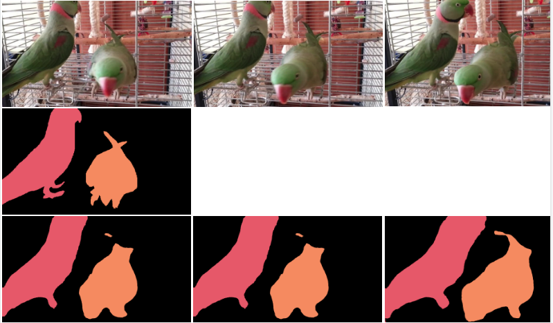
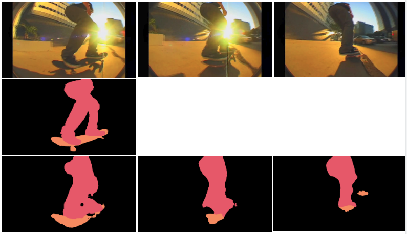

### Video Object Segmentation - YouTube VOS dataset (Ning et al.,arXiv preprint arXiv:1809.03327)
This is the implementation of the paper "Youtube-VOS: Sequence-to-sequence video object segmentation" by Ning et al, ECCV 2018.  

### Getting the Data  
Download the data by registering on [CodeLab challenge](https://competitions.codalab.org/competitions/19544) 

### Data preperation & description
Install the dependencies as listed in ```requirements.txt```. Since this is an instance level segmentation task, each instance level annotation along with the frame associated with it is mentioned in the ```meta.json``` file which will be available when you download the dataset.  
During training, every 5th frame is annotated i.e. we have the segmentation ground truth for every 5th frame in the set. But in the validation set, only the first frame is annotated and our model is excepted to generate the instance segmentation for the corresponding object in consecutive frames.

### Training the network
You can modify the ```utils/dataloader5fps.py``` based on your requirements. To train the model run  
```python3 train.py```   

### Testing
Once the model is trained, use it to generate the segmentation masks for each instance individually by executing ```python3 test.py```. This will create a folder with segmentation mask of each object corresponing to the video in the validation set. The segmentation is basically the probability scores of each pixel values. In order to combine these segmentation masks and get the instance level segmentation for the frame as a whole, we do an argmax for a given frame and all the instances associated with it. This can be obtained by executing ```python3 mergeAnnotations/py```. 
  
### Qualitative Results  
  
----------------------------------------------------------------------------------------------------------------------------
----------------------------------------------------------------------------------------------------------------------------
  

Here the 1st row is the RGB frames, second row corresponds to the ground truth segmentation mask on the objects that our network is exected to predict in the consecutive frames and the last row corresponds to the prediction of my trained model.

### Quatitative Results  
|Overall   |J_seen   |J_unseen   |F_seen   |F_unseen  |
|---|---|---|---|---|
|0.461|0.566|0.219|0.583|0.388|


### Contributing
There is lot of scope for improvements with respect to the performance. PR's and discussion in this regard or any general matter on this topic is welcome :)
